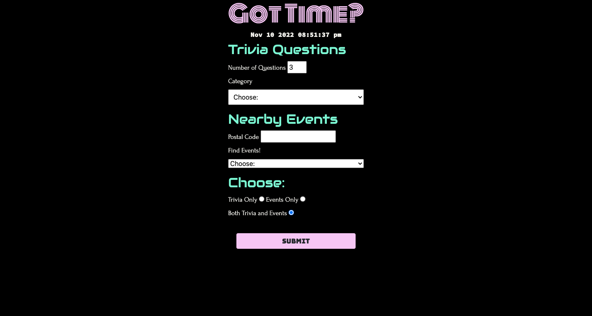

# Got Time? Web Application

## Description

If users have some free time in their schedule, they can access this web application to entertain themselves with various trivia questions and/or search for events nearby. 

For trivia, users can enter the number of questions and choose a category (TV, music, mathematics, etc.). To search for events nearby, users can enter their postal code and choose the type of event (theater, concert, or sports). Using the buttons provided, users can save one or more of the events listed on the page. The saved events are stored and displayed on the same page.

At the bottom of the page, a quote along with the author's name is displayed to provide some inspiration.

The codebase for this web application can be accessed via the links below. The use of the following can be observed from there:  

SeatGeek Platform's API, Open Trivia Database, https://api.goprogram.ai/inspiration/docs/, jQuery, Bootstrap, Moment.js, and Google Fonts

## Links

To access the deployed application, please visit: https://shurikenbebe.github.io/got-time/

The codebase can be accessed via https://github.com/SHURIKENBEBE/got-time

## Screenshot

The following is the screenshot for the web application:

